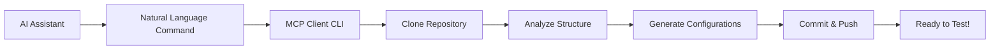

# AI-Driven MCP Repository Configuration Guide

## Overview

The MCP Client CLI now features an AI-driven configuration system that allows you to automatically set up testing pipelines for any MCP server repository using natural language commands. Instead of manually copying files and configurations, AI assistants can now clone, configure, and deploy testing infrastructure with a single command.

## How It Works

### The Magic Behind the Scenes



**Traditional Approach** (What we replaced):
- Manual file copying
- Complex setup instructions
- Repository-specific modifications
- Maintenance overhead

**New AI-Driven Approach**:
- Natural language commands
- Automatic repository analysis
- Intelligent configuration generation
- Zero maintenance overhead

## Quick Start

### Prerequisites

1. **Install MCP Client CLI**:
   ```bash
   pip install mcp-client-cli
   ```

2. **Set up Authentication**:
   ```bash
   # For SSH (recommended)
   ssh-add ~/.ssh/id_rsa
   
   # For GitHub token
   export GITHUB_TOKEN="your_token_here"
   ```

3. **Verify Installation**:
   ```bash
   llm --version
   ```

### Basic Usage

The simplest way to configure a repository:

```bash
llm --ai-configure setup-testing --repo-url https://github.com/user/my-mcp-server
```

That's it! The system will:
- Clone the repository
- Analyze its structure
- Generate appropriate configurations
- Commit and push the changes
- Set up GitHub Actions for testing

## AI Assistant Integration

### For Cursor with Windsurd/Claude

**Prompt Template**:
```
Configure MCP testing for https://github.com/user/my-mcp-server

Use the MCP Client CLI AI configuration system to set up comprehensive testing for this repository. Include functional testing, security scanning, and performance benchmarks.
```

**What happens**:
1. Cursor/Claude recognizes the MCP configuration request
2. Executes: `llm --ai-configure setup-testing --repo-url https://github.com/user/my-mcp-server`
3. Shows progress and results
4. Repository is ready for testing

### For GitHub Copilot

**In VS Code Terminal**:
```bash
# Copilot can suggest and execute:
llm --ai-configure setup-testing --repo-url https://github.com/user/my-mcp-server --auth-method ssh
```

**In Chat**:
```
@terminal Set up MCP testing for my repository using the AI configuration system
```

### For Claude (Standalone)

**Prompt**:
```
I need to configure MCP testing for my repository at https://github.com/user/my-mcp-server. 
Please use the MCP Client CLI AI configuration system to set this up automatically.
```

Claude will execute the appropriate commands and guide you through the process.

## Configuration Options

### Authentication Methods

```bash
# SSH (default, recommended)
llm --ai-configure setup-testing --repo-url <url> --auth-method ssh

# GitHub Token
llm --ai-configure setup-testing --repo-url <url> --auth-method token

# Interactive (prompts for credentials)
llm --ai-configure setup-testing --repo-url <url> --auth-method interactive
```

### Configuration Types

```bash
# Full testing setup (default)
llm --ai-configure setup-testing --repo-url <url>

# CI/CD pipeline only
llm --ai-configure add-ci --repo-url <url>

# Security testing focus
llm --ai-configure enable-security --repo-url <url>
```

### Preview Mode

```bash
# See what will be configured without applying changes
llm --ai-configure setup-testing --repo-url <url> --config-preview
```

## What Gets Configured

### For Python MCP Servers

**Generated Files**:
```
.github/workflows/mcp-testing.yml    # GitHub Actions workflow
test-config.json                     # MCP testing configuration
TESTING.md                          # Testing documentation
requirements-test.txt               # Testing dependencies (if needed)
```

**GitHub Actions Workflow**:
- Python environment setup (3.8, 3.9, 3.10, 3.11)
- Dependency installation
- MCP server functional testing
- Security vulnerability scanning
- Performance benchmarking
- Test result reporting

### For Node.js MCP Servers

**Generated Files**:
```
.github/workflows/mcp-testing.yml    # GitHub Actions workflow
test-config.json                     # MCP testing configuration
TESTING.md                          # Testing documentation
package.json                        # Updated with test scripts
```

**GitHub Actions Workflow**:
- Node.js environment setup (16, 18, 20)
- npm/yarn dependency installation
- MCP server functional testing
- Security audit
- Performance testing
- Coverage reporting

### Universal Components

**test-config.json** (Auto-generated based on repository analysis):
```json
{
  "server_config": {
    "command": "python",
    "args": ["server.py"],
    "env": {
      "NODE_ENV": "test"
    }
  },
  "test_config": {
    "timeout": 30,
    "max_retries": 3,
    "test_types": ["functional", "security", "performance"]
  }
}
```

**TESTING.md** (Comprehensive testing guide):
- Local testing instructions
- CI/CD pipeline explanation
- Troubleshooting guide
- Badge integration

## Real-World Examples

### Example 1: Python FastMCP Server

**Repository**: `https://github.com/user/weather-mcp-server`

**Command**:
```bash
llm --ai-configure setup-testing --repo-url https://github.com/user/weather-mcp-server
```

**Repository Analysis Results**:
- **Detected**: Python MCP server
- **Entry Point**: `weather_server.py`
- **Dependencies**: `requirements.txt` with `mcp`, `requests`
- **Server Type**: FastMCP-based

**Generated Configuration**:
```yaml
# .github/workflows/mcp-testing.yml
name: MCP Server Testing
on: [push, pull_request]
jobs:
  test:
    runs-on: ubuntu-latest
    strategy:
      matrix:
        python-version: [3.8, 3.9, 3.10, 3.11]
    steps:
      - uses: actions/checkout@v4
      - name: Set up Python
        uses: actions/setup-python@v4
        with:
          python-version: ${{ matrix.python-version }}
      - name: Install dependencies
        run: |
          pip install -r requirements.txt
          pip install mcp-client-cli
      - name: Test MCP Server
        run: |
          llm --test-config test-config.json --timeout 30
```

### Example 2: Node.js TypeScript Server

**Repository**: `https://github.com/user/database-mcp-server`

**Command**:
```bash
llm --ai-configure setup-testing --repo-url https://github.com/user/database-mcp-server --auth-method token
```

**Repository Analysis Results**:
- **Detected**: Node.js TypeScript MCP server
- **Entry Point**: `dist/index.js` (built from `src/index.ts`)
- **Dependencies**: `package.json` with `@modelcontextprotocol/sdk`
- **Build System**: TypeScript with npm scripts

**Generated Configuration**:
```yaml
# .github/workflows/mcp-testing.yml
name: MCP Server Testing
on: [push, pull_request]
jobs:
  test:
    runs-on: ubuntu-latest
    strategy:
      matrix:
        node-version: [16, 18, 20]
    steps:
      - uses: actions/checkout@v4
      - name: Setup Node.js
        uses: actions/setup-node@v4
        with:
          node-version: ${{ matrix.node-version }}
      - name: Install dependencies
        run: npm ci
      - name: Build project
        run: npm run build
      - name: Test MCP Server
        run: |
          npm install -g mcp-client-cli
          llm --test-config test-config.json --timeout 30
```

## Advanced Usage

### Custom Configuration Templates

You can customize the generated configurations by providing template overrides:

```bash
llm --ai-configure setup-testing \
    --repo-url https://github.com/user/my-server \
    --template-override github-actions=custom-workflow.yml \
    --template-override test-config=custom-test-config.json
```

### Batch Configuration

Configure multiple repositories:

```bash
# Using a repository list file
llm --ai-configure batch-setup --repo-list repositories.txt

# repositories.txt content:
# https://github.com/user/server1
# https://github.com/user/server2
# https://github.com/user/server3
```

### Integration with Existing CI/CD

If the repository already has GitHub Actions:

```bash
# Merge with existing workflows
llm --ai-configure add-ci --repo-url <url> --merge-existing

# Replace existing workflows
llm --ai-configure add-ci --repo-url <url> --replace-existing
```

## Troubleshooting

### Common Issues

**Authentication Failures**:
```bash
# Check SSH key
ssh -T git@github.com

# Verify token permissions
curl -H "Authorization: token $GITHUB_TOKEN" https://api.github.com/user
```

**Repository Analysis Errors**:
```bash
# Enable verbose logging
llm --ai-configure setup-testing --repo-url <url> --verbose

# Manual analysis
llm --analyze-repo --repo-url <url> --local-clone
```

**Configuration Validation Failures**:
```bash
# Preview and validate before applying
llm --ai-configure setup-testing --repo-url <url> --config-preview --validate
```

### Getting Help

**Built-in Help**:
```bash
llm --ai-configure --help
llm --ai-configure setup-testing --help
```

**Verbose Output**:
```bash
llm --ai-configure setup-testing --repo-url <url> --verbose --debug
```

**Configuration Validation**:
```bash
llm --validate-config --config-file test-config.json
llm --validate-workflow --workflow-file .github/workflows/mcp-testing.yml
```

## Best Practices

### Repository Preparation

1. **Clear Entry Points**: Ensure your MCP server has a clear entry point (`server.py`, `index.js`, etc.)
2. **Dependencies**: Maintain up-to-date `requirements.txt` or `package.json`
3. **Documentation**: Include basic README with server description
4. **Environment Variables**: Document required environment variables

### Security Considerations

1. **Secrets Management**: Use GitHub Secrets for sensitive data
2. **Token Permissions**: Use minimal required permissions for GitHub tokens
3. **SSH Keys**: Use dedicated SSH keys for automation
4. **Code Review**: Review generated configurations before merging

### Performance Optimization

1. **Caching**: Generated workflows include dependency caching
2. **Parallel Testing**: Matrix builds for multiple environments
3. **Selective Testing**: Configure test types based on repository needs
4. **Resource Limits**: Set appropriate timeouts and resource limits

## Migration from Legacy Reverse Integration

If you're migrating from the old reverse integration approach:

### Automatic Migration

```bash
# Migrate existing reverse integration setup
llm --migrate-from-reverse-integration --repo-url <url>
```

### Manual Migration Steps

1. **Remove Old Files**:
   ```bash
   # Remove old reverse integration files
   rm -rf .github/workflows/pytest-mcp-server-self-test.yml
   rm -rf scripts/test-pytest-mcp-server.py
   rm -rf test-pytest-mcp-server.json
   ```

2. **Apply New Configuration**:
   ```bash
   llm --ai-configure setup-testing --repo-url <current-repo>
   ```

3. **Update Documentation**:
   - Remove references to old testing approach
   - Update badges and status indicators
   - Add new testing documentation

## API Reference

### Command Line Interface

```bash
llm --ai-configure <command> [options]

Commands:
  setup-testing     Complete MCP testing setup
  add-ci           Add CI/CD pipeline only
  enable-security  Enable security testing
  batch-setup      Configure multiple repositories

Options:
  --repo-url URL              Target repository URL
  --auth-method METHOD        Authentication method (ssh|token|interactive)
  --config-preview           Preview configuration without applying
  --template-override KEY=VAL Override specific templates
  --merge-existing           Merge with existing configurations
  --replace-existing         Replace existing configurations
  --verbose                  Enable verbose output
  --debug                    Enable debug logging
```

### Configuration File Schema

**test-config.json**:
```json
{
  "server_config": {
    "command": "string",           // Server command
    "args": ["string"],           // Command arguments
    "env": {"key": "value"},      // Environment variables
    "working_dir": "string"       // Working directory
  },
  "test_config": {
    "timeout": 30,                // Test timeout in seconds
    "max_retries": 3,             // Maximum retry attempts
    "test_types": ["string"],     // Test types to run
    "parallel": true,             // Run tests in parallel
    "coverage": true              // Enable coverage reporting
  },
  "github_actions": {
    "environments": ["string"],   // Test environments
    "triggers": ["string"],       // Workflow triggers
    "secrets": ["string"]         // Required secrets
  }
}
```

## Contributing

### Adding New Server Types

1. **Create Template**: Add Jinja2 templates for new server type
2. **Update Analysis**: Extend repository analysis logic
3. **Add Tests**: Include test cases for new server type
4. **Update Documentation**: Add examples and configuration details

### Improving AI Prompts

1. **Test Prompts**: Validate with different AI assistants
2. **Gather Feedback**: Collect user experience data
3. **Iterate**: Refine prompts based on success rates
4. **Document**: Update prompt templates and examples

## Conclusion

The AI-driven MCP repository configuration system transforms the complex process of setting up testing infrastructure into a simple, natural language interaction. Whether you're using Cursor, Claude, GitHub Copilot, or the command line directly, you can now configure comprehensive MCP testing with a single command.

**Key Benefits**:
- ⚡ **Speed**: Configure repositories in seconds, not hours
- 🤖 **Intelligence**: Automatic analysis and appropriate configuration
- 🔒 **Security**: Built-in security testing and best practices
- 🔄 **Maintenance**: Zero ongoing maintenance overhead
- 🌐 **Universal**: Works with any MCP server type
- 🎯 **Accurate**: Intelligent analysis ensures correct configuration

The system preserves all the testing intelligence and best practices from the previous reverse integration approach while making it dramatically easier to use and maintain.

---

*For more information, visit the [MCP Client CLI Documentation](https://github.com/user/mcp-client-cli) or join our [Discord Community](https://discord.gg/mcp).* 