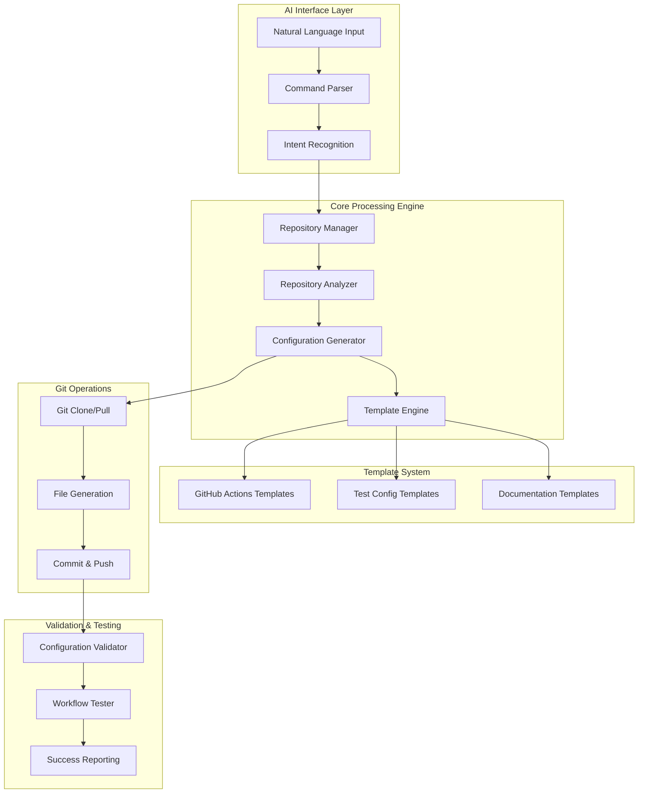

# Technical Architecture: AI-Driven MCP Configuration System

## System Overview

The AI-driven MCP configuration system is built on a modular architecture that combines repository analysis, template generation, and Git automation to provide seamless MCP testing setup.

## Architecture Diagram



## Module Structure

### Core Modules

```
src/mcp_client_cli/ai_config/
├── __init__.py
├── core/
│   ├── __init__.py
│   ├── command_parser.py      # CLI command parsing and routing
│   ├── intent_recognizer.py   # Natural language intent recognition
│   └── workflow_orchestrator.py # Main workflow coordination
├── repository/
│   ├── __init__.py
│   ├── manager.py            # Git operations and repository management
│   ├── analyzer.py           # Repository structure analysis
│   └── auth.py              # Authentication handling
├── templates/
│   ├── __init__.py
│   ├── engine.py            # Jinja2 template processing
│   ├── github_actions/      # GitHub Actions workflow templates
│   ├── test_configs/        # Test configuration templates
│   └── documentation/       # Documentation templates
├── validation/
│   ├── __init__.py
│   ├── config_validator.py  # Configuration validation
│   └── workflow_tester.py   # Workflow testing
└── utils/
    ├── __init__.py
    ├── file_operations.py    # File system utilities
    └── logging.py           # Logging configuration
```

## Component Details

### 1. Command Parser (`core/command_parser.py`)

**Purpose**: Parse CLI commands and route to appropriate handlers.

**Key Functions**:
```python
class CommandParser:
    def parse_ai_configure_command(self, args: List[str]) -> ConfigCommand
    def validate_parameters(self, command: ConfigCommand) -> ValidationResult
    def route_to_handler(self, command: ConfigCommand) -> Handler
```

**Integration Points**:
- CLI entry point (`src/mcp_client_cli/cli.py`)
- Intent recognizer for natural language processing
- Workflow orchestrator for execution

### 2. Repository Manager (`repository/manager.py`)

**Purpose**: Handle Git operations and repository lifecycle.

**Key Functions**:
```python
class RepositoryManager:
    def clone_repository(self, url: str, auth: AuthConfig) -> Repository
    def analyze_structure(self, repo: Repository) -> AnalysisResult
    def apply_configurations(self, repo: Repository, configs: List[Config]) -> None
    def commit_and_push(self, repo: Repository, message: str) -> CommitResult
```

**Authentication Support**:
- SSH key authentication (default)
- GitHub token authentication
- Interactive credential prompting

### 3. Repository Analyzer (`repository/analyzer.py`)

**Purpose**: Analyze repository structure and determine appropriate configurations.

**Analysis Capabilities**:
```python
class RepositoryAnalyzer:
    def detect_server_type(self, repo: Repository) -> ServerType
    def find_entry_points(self, repo: Repository) -> List[EntryPoint]
    def analyze_dependencies(self, repo: Repository) -> DependencyInfo
    def detect_build_system(self, repo: Repository) -> BuildSystem
    def recommend_test_config(self, analysis: AnalysisResult) -> TestConfig
```

**Server Type Detection**:
- Python MCP servers (FastMCP, custom implementations)
- Node.js MCP servers (TypeScript, JavaScript)
- Go MCP servers
- Rust MCP servers
- Generic/unknown servers

### 4. Template Engine (`templates/engine.py`)

**Purpose**: Generate configurations from templates based on analysis results.

**Template Categories**:
```python
class TemplateEngine:
    def render_github_actions(self, context: TemplateContext) -> str
    def render_test_config(self, context: TemplateContext) -> Dict
    def render_documentation(self, context: TemplateContext) -> str
    def apply_custom_overrides(self, template: str, overrides: Dict) -> str
```

**Template Context**:
```python
@dataclass
class TemplateContext:
    server_type: ServerType
    entry_points: List[str]
    dependencies: DependencyInfo
    build_system: BuildSystem
    test_requirements: TestConfig
    repository_info: RepositoryInfo
```

## Template System

### GitHub Actions Templates

**Python Server Template** (`templates/github_actions/python_mcp_server.yml.j2`):
```yaml
name: MCP Server Testing
on: [push, pull_request]

jobs:
  test:
    runs-on: ubuntu-latest
    strategy:
      matrix:
        python-version: {{ python_versions | tojson }}
    
    steps:
      - uses: actions/checkout@v4
      
      - name: Set up Python ${{ matrix.python-version }}
        uses: actions/setup-python@v4
        with:
          python-version: ${{ matrix.python-version }}
      
      - name: Cache dependencies
        uses: actions/cache@v3
        with:
          path: ~/.cache/pip
          key: ${{ runner.os }}-pip-${{ hashFiles('**/requirements*.txt') }}
      
      - name: Install dependencies
        run: |
          python -m pip install --upgrade pip
          
          pip install -r {{ req_file }}
          
          pip install mcp-client-cli
      
      - name: Test MCP Server
        run: |
          llm --test-config test-config.json --timeout {{ test_timeout }}
        env:
          
          {{ key }}: {{ value }}
          
```

**Node.js Server Template** (`templates/github_actions/nodejs_mcp_server.yml.j2`):
```yaml
name: MCP Server Testing
on: [push, pull_request]

jobs:
  test:
    runs-on: ubuntu-latest
    strategy:
      matrix:
        node-version: {{ node_versions | tojson }}
    
    steps:
      - uses: actions/checkout@v4
      
      - name: Setup Node.js ${{ matrix.node-version }}
        uses: actions/setup-node@v4
        with:
          node-version: ${{ matrix.node-version }}
          cache: '{{ package_manager }}'
      
      - name: Install dependencies
        run: {{ install_command }}
      
      
      - name: Build project
        run: {{ build_command }}
      
      
      - name: Test MCP Server
        run: |
          npm install -g mcp-client-cli
          llm --test-config test-config.json --timeout {{ test_timeout }}
```

### Test Configuration Templates

**Base Test Config** (`templates/test_configs/base_config.json.j2`):
```json
{
  "server_config": {
    "command": "{{ server_command }}",
    "args": {{ server_args | tojson }},
    
    "working_dir": "{{ working_directory }}",
    
    "env": {
      
      "{{ key }}": "{{ value }}",
      
    }
  },
  "test_config": {
    "timeout": {{ test_timeout }},
    "max_retries": {{ max_retries }},
    "test_types": {{ test_types | tojson }},
    "parallel": {{ parallel_testing | lower }},
    "coverage": {{ enable_coverage | lower }}
  },
  "github_actions": {
    "environments": {{ test_environments | tojson }},
    "triggers": {{ workflow_triggers | tojson }},
    "secrets": {{ required_secrets | tojson }}
  }
}
```

## Workflow Orchestration

### Main Configuration Workflow

```python
class WorkflowOrchestrator:
    async def execute_setup_testing(self, command: SetupTestingCommand) -> Result:
        """Main workflow for setting up MCP testing."""
        
        # 1. Authentication and validation
        auth_config = await self.auth_manager.setup_authentication(
            method=command.auth_method,
            repo_url=command.repo_url
        )
        
        # 2. Repository operations
        repo = await self.repo_manager.clone_repository(
            url=command.repo_url,
            auth=auth_config
        )
        
        # 3. Analysis phase
        analysis = await self.analyzer.analyze_repository(repo)
        
        # 4. Configuration generation
        configs = await self.template_engine.generate_configurations(
            analysis=analysis,
            overrides=command.template_overrides
        )
        
        # 5. Preview mode (if requested)
        if command.preview_mode:
            return self.generate_preview(configs)
        
        # 6. Validation
        validation_result = await self.validator.validate_configurations(configs)
        if not validation_result.is_valid:
            return Result.error(validation_result.errors)
        
        # 7. Apply configurations
        await self.repo_manager.apply_configurations(repo, configs)
        
        # 8. Commit and push
        commit_result = await self.repo_manager.commit_and_push(
            repo=repo,
            message=f"Add MCP testing configuration\n\nGenerated by mcp-client-cli AI configuration system"
        )
        
        # 9. Post-deployment validation
        if command.validate_deployment:
            await self.workflow_tester.test_generated_workflow(repo)
        
        return Result.success(commit_result)
```

## Repository Analysis Engine

### Analysis Pipeline

```python
class RepositoryAnalyzer:
    def analyze_repository(self, repo: Repository) -> AnalysisResult:
        """Comprehensive repository analysis."""
        
        analysis = AnalysisResult()
        
        # File structure analysis
        analysis.file_structure = self._analyze_file_structure(repo)
        
        # Server type detection
        analysis.server_type = self._detect_server_type(repo)
        
        # Entry point detection
        analysis.entry_points = self._find_entry_points(repo)
        
        # Dependency analysis
        analysis.dependencies = self._analyze_dependencies(repo)
        
        # Build system detection
        analysis.build_system = self._detect_build_system(repo)
        
        # Configuration recommendations
        analysis.recommendations = self._generate_recommendations(analysis)
        
        return analysis
    
    def _detect_server_type(self, repo: Repository) -> ServerType:
        """Detect MCP server type and framework."""
        
        # Python detection
        if repo.has_file("requirements.txt") or repo.has_file("pyproject.toml"):
            if "fastmcp" in repo.get_dependencies():
                return ServerType.PYTHON_FASTMCP
            elif "mcp" in repo.get_dependencies():
                return ServerType.PYTHON_MCP
            return ServerType.PYTHON_GENERIC
        
        # Node.js detection
        if repo.has_file("package.json"):
            package_json = repo.read_json("package.json")
            deps = {**package_json.get("dependencies", {}), 
                   **package_json.get("devDependencies", {})}
            
            if "@modelcontextprotocol/sdk" in deps:
                return ServerType.NODEJS_MCP
            return ServerType.NODEJS_GENERIC
        
        # Go detection
        if repo.has_file("go.mod"):
            return ServerType.GO_MCP
        
        # Rust detection
        if repo.has_file("Cargo.toml"):
            return ServerType.RUST_MCP
        
        return ServerType.UNKNOWN
```

### Entry Point Detection

```python
def _find_entry_points(self, repo: Repository) -> List[EntryPoint]:
    """Find potential MCP server entry points."""
    
    entry_points = []
    
    # Python entry points
    if repo.server_type.is_python():
        # Look for common patterns
        candidates = [
            "server.py", "main.py", "app.py",
            "src/server.py", "src/main.py",
            f"{repo.name}/server.py"
        ]
        
        for candidate in candidates:
            if repo.has_file(candidate):
                # Analyze file content for MCP patterns
                content = repo.read_file(candidate)
                if self._is_mcp_server_file(content):
                    entry_points.append(EntryPoint(
                        path=candidate,
                        type="python",
                        confidence=0.9
                    ))
    
    # Node.js entry points
    elif repo.server_type.is_nodejs():
        package_json = repo.read_json("package.json")
        
        # Check package.json main field
        if "main" in package_json:
            entry_points.append(EntryPoint(
                path=package_json["main"],
                type="nodejs",
                confidence=0.95
            ))
        
        # Check for common patterns
        candidates = ["index.js", "server.js", "dist/index.js", "build/index.js"]
        for candidate in candidates:
            if repo.has_file(candidate):
                entry_points.append(EntryPoint(
                    path=candidate,
                    type="nodejs",
                    confidence=0.8
                ))
    
    return entry_points
```

## Authentication System

### Multi-Method Authentication

```python
class AuthenticationManager:
    async def setup_authentication(self, method: str, repo_url: str) -> AuthConfig:
        """Set up authentication for repository access."""
        
        if method == "ssh":
            return await self._setup_ssh_auth(repo_url)
        elif method == "token":
            return await self._setup_token_auth()
        elif method == "interactive":
            return await self._setup_interactive_auth(repo_url)
        else:
            raise ValueError(f"Unknown authentication method: {method}")
    
    async def _setup_ssh_auth(self, repo_url: str) -> SSHAuthConfig:
        """Set up SSH key authentication."""
        
        # Check for existing SSH keys
        ssh_keys = self._find_ssh_keys()
        
        if not ssh_keys:
            raise AuthenticationError("No SSH keys found. Please set up SSH keys first.")
        
        # Test SSH connection
        if not await self._test_ssh_connection(repo_url):
            raise AuthenticationError("SSH authentication failed. Please check your SSH keys.")
        
        return SSHAuthConfig(key_path=ssh_keys[0])
    
    async def _setup_token_auth(self) -> TokenAuthConfig:
        """Set up GitHub token authentication."""
        
        token = os.getenv("GITHUB_TOKEN")
        if not token:
            token = input("Enter GitHub token: ").strip()
        
        # Validate token
        if not await self._validate_github_token(token):
            raise AuthenticationError("Invalid GitHub token.")
        
        return TokenAuthConfig(token=token)
```

## Configuration Validation

### Multi-Layer Validation

```python
class ConfigurationValidator:
    def validate_configurations(self, configs: List[Configuration]) -> ValidationResult:
        """Validate generated configurations."""
        
        result = ValidationResult()
        
        for config in configs:
            # Syntax validation
            syntax_result = self._validate_syntax(config)
            result.add_result(syntax_result)
            
            # Semantic validation
            semantic_result = self._validate_semantics(config)
            result.add_result(semantic_result)
            
            # Security validation
            security_result = self._validate_security(config)
            result.add_result(security_result)
        
        # Cross-configuration validation
        cross_result = self._validate_cross_configurations(configs)
        result.add_result(cross_result)
        
        return result
    
    def _validate_syntax(self, config: Configuration) -> ValidationResult:
        """Validate configuration syntax."""
        
        if config.type == "github_actions":
            return self._validate_yaml_syntax(config.content)
        elif config.type == "test_config":
            return self._validate_json_syntax(config.content)
        elif config.type == "documentation":
            return self._validate_markdown_syntax(config.content)
        
        return ValidationResult.success()
```

## Error Handling and Recovery

### Comprehensive Error Architecture

```python
class ErrorHandler:
    def handle_error(self, error: Exception, context: ExecutionContext) -> RecoveryAction:
        """Handle errors with appropriate recovery strategies."""
        
        if isinstance(error, AuthenticationError):
            return self._handle_auth_error(error, context)
        elif isinstance(error, RepositoryError):
            return self._handle_repo_error(error, context)
        elif isinstance(error, TemplateError):
            return self._handle_template_error(error, context)
        elif isinstance(error, ValidationError):
            return self._handle_validation_error(error, context)
        else:
            return self._handle_unknown_error(error, context)
    
    def _handle_auth_error(self, error: AuthenticationError, context: ExecutionContext) -> RecoveryAction:
        """Handle authentication errors with fallback methods."""
        
        if context.auth_method == "ssh":
            # Try token authentication as fallback
            return RecoveryAction.retry_with_different_auth("token")
        elif context.auth_method == "token":
            # Try interactive authentication
            return RecoveryAction.retry_with_different_auth("interactive")
        else:
            return RecoveryAction.fail_with_message(
                "All authentication methods failed. Please check your credentials."
            )
```

## Performance Optimization

### Caching and Optimization Strategies

```python
class PerformanceOptimizer:
    def __init__(self):
        self.template_cache = LRUCache(maxsize=100)
        self.analysis_cache = LRUCache(maxsize=50)
    
    @cached_property
    def template_engine(self) -> TemplateEngine:
        """Cached template engine instance."""
        return TemplateEngine(cache=self.template_cache)
    
    async def analyze_repository_cached(self, repo: Repository) -> AnalysisResult:
        """Repository analysis with caching."""
        
        cache_key = f"{repo.url}:{repo.commit_hash}"
        
        if cache_key in self.analysis_cache:
            return self.analysis_cache[cache_key]
        
        analysis = await self.analyzer.analyze_repository(repo)
        self.analysis_cache[cache_key] = analysis
        
        return analysis
```

## Testing Framework Integration

### Integration with Existing Test Modules

The AI configuration system integrates with the existing testing framework:

```python
# Integration with existing test modules
from mcp_client_cli.testing import (
    mcp_tester,
    security_tester,
    performance_tester,
    integration_tester
)

class TestConfigurationGenerator:
    def generate_test_config(self, analysis: AnalysisResult) -> TestConfig:
        """Generate test configuration using existing test modules."""
        
        config = TestConfig()
        
        # Functional testing configuration
        config.functional = mcp_tester.generate_config(analysis)
        
        # Security testing configuration
        config.security = security_tester.generate_config(analysis)
        
        # Performance testing configuration
        config.performance = performance_tester.generate_config(analysis)
        
        # Integration testing configuration
        config.integration = integration_tester.generate_config(analysis)
        
        return config
```

## Monitoring and Observability

### Comprehensive Logging and Metrics

```python
class ObservabilityManager:
    def __init__(self):
        self.logger = self._setup_logging()
        self.metrics = MetricsCollector()
    
    def track_configuration_request(self, command: ConfigCommand):
        """Track configuration requests for analytics."""
        
        self.metrics.increment("config_requests_total", {
            "server_type": command.detected_server_type,
            "auth_method": command.auth_method,
            "success": command.success
        })
        
        self.logger.info(
            "Configuration request",
            extra={
                "repo_url": command.repo_url,
                "server_type": command.detected_server_type,
                "duration": command.duration,
                "success": command.success
            }
        )
```

## Future Extensions

### Planned Enhancements

1. **Multi-Language Support**: Extend to support more programming languages
2. **Custom Template Registry**: Allow users to register custom templates
3. **Workflow Optimization**: AI-driven workflow optimization based on usage patterns
4. **Integration Ecosystem**: Integrate with more CI/CD platforms (GitLab, Bitbucket)
5. **Advanced Analytics**: Repository health scoring and recommendations

### Extension Points

```python
class ExtensionRegistry:
    """Registry for system extensions."""
    
    def register_server_type_detector(self, detector: ServerTypeDetector):
        """Register custom server type detector."""
        pass
    
    def register_template_provider(self, provider: TemplateProvider):
        """Register custom template provider."""
        pass
    
    def register_auth_method(self, method: AuthMethod):
        """Register custom authentication method."""
        pass
```

This technical architecture provides a robust, extensible foundation for the AI-driven MCP configuration system while maintaining compatibility with the existing MCP Client CLI infrastructure. 